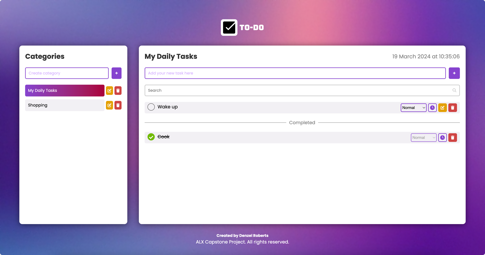

# alx_capstone_project
Project Overview:
This is a responsive Task Manager application that can help users to schedule and plan their day to day activities to make them productive.

Features and Functionality:
- Ability to create tasks
- Ability to create different task categories
- Ability to edit a task/category
- Ability to delete a task/category
- Effective search functionality
- Ability to set due date to tasks
- Reminder notification functionality
- Ability to add urgency to a task

Technologies Used:
-HTML
-CSS
-Javascript

Screenshots:

Contact information:
Denzel Roberts
phone: 0545751648
email: iamdenzelroberts@gmail.com
